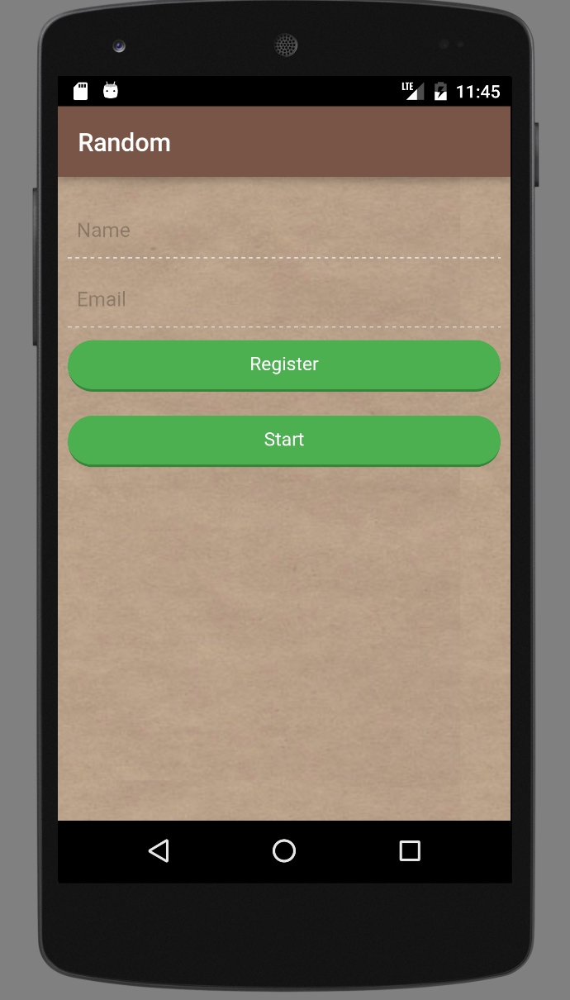
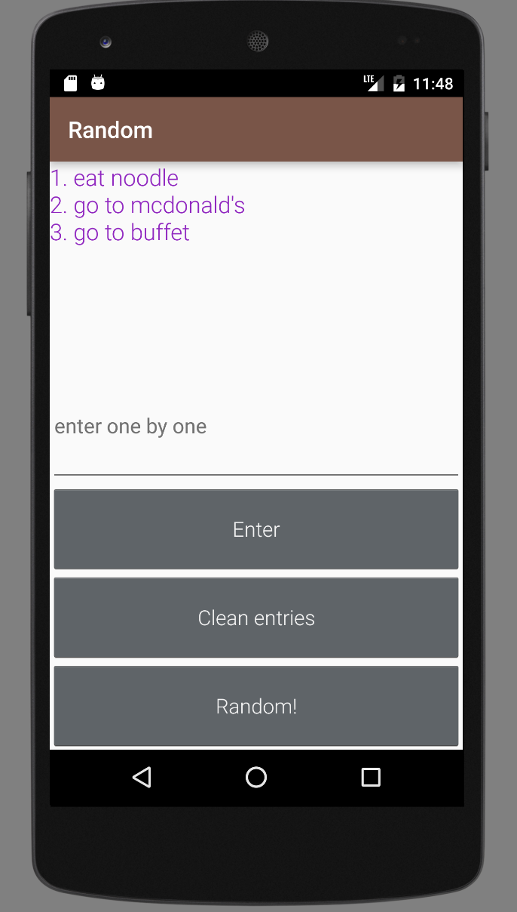
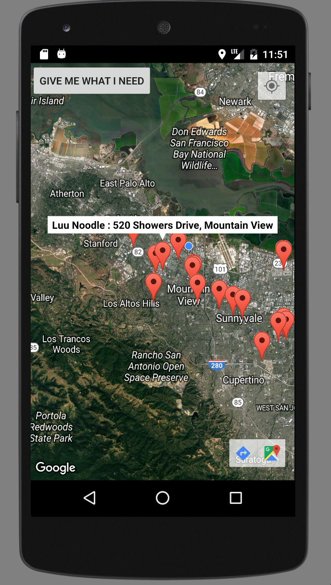

# Random
 
This is an android app that help user generate random choices, other than that, it can help user search nearby places. 
#### Some highlight implementations:
**1. Implemented HybridApp for users to signup and login **
 
**2. Implemented SQLite **
 
**3. Implemented Google Nearby API **
 

**Note:** This app is still under developement.